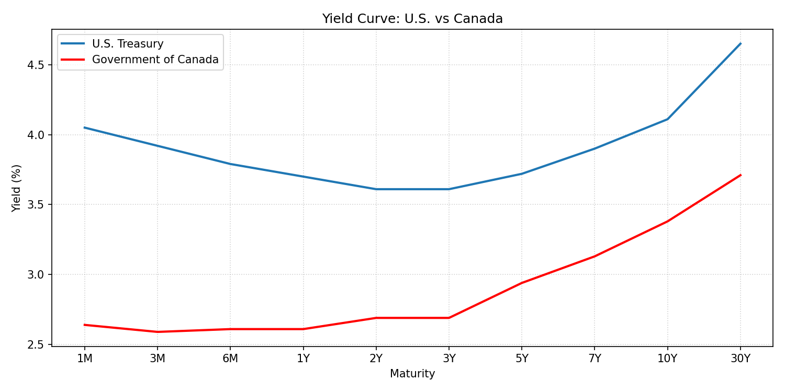

# U.S.-vs-CAD Yield Curve

This graph demonstrates the difference between the U.S. and Canada yield curve, helping to see the shape and spread between both countries' bonds.

The image updates nightly via GitHub Actions using data from the U.S. Treasury (or FRED) and the Bank of Canada Valet API.
